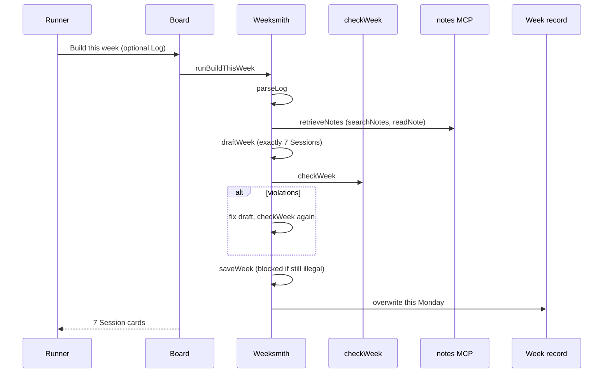
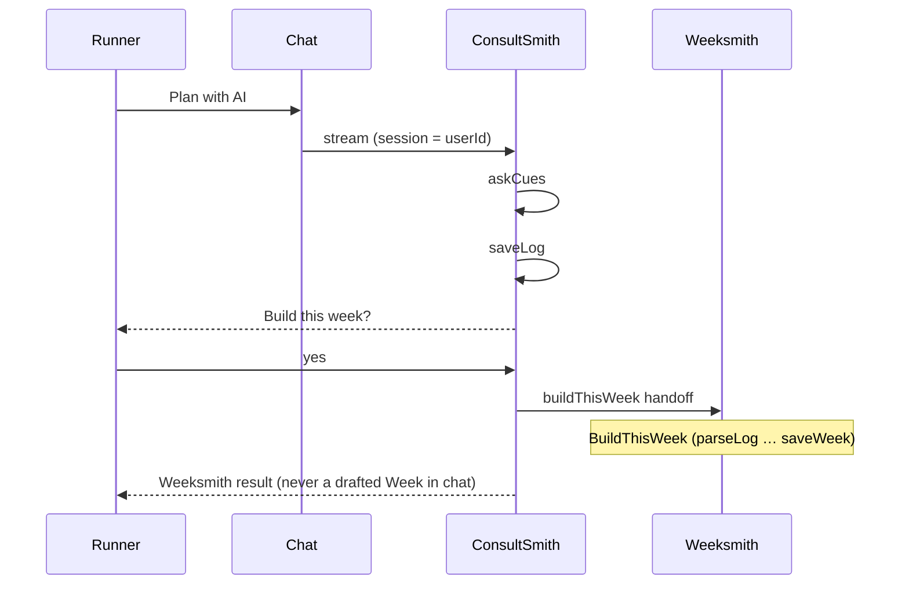

# RunMax

One runner’s **this Week** of running from an optional messy **Log** — shown as a **Board** on mobile-first web. See [CONTEXT.md](CONTEXT.md) for the domain language and [document/PRD.en.md](document/PRD.en.md) for the full PRD.

Home is the Board, not chat. **Weeksmith** is the only agent that may draft, check, and save a Week. **ConsultSmith** interviews, writes the Log, then hands off.

## Stack

- pnpm workspace — `packages/domain` (shared rules), `packages/agent` (Weeksmith + ConsultSmith on Anvia), `apps/api` (BE), `apps/platform` (FE)
- Agent: `@anvia/core` + `@anvia/openai` + `@anvia/mcp` + `@langfuse/otel` + `@langfuse/tracing`
- Model: `WEEKSMITH_MODEL` from root `.env` (fallback `glm-5.3-flash`) via `OPENAI_BASE_URL`; effort `WEEKSMITH_EFFORT` = `low` \| `high` \| `max` (default **max**)
- FE: Vite 8 · React 19 · TanStack Router · Tailwind CSS 4

## Get started

1. Install dependencies

   ```bash
   pnpm install
   ```

2. Copy `.env.example` → `.env` and set `OPENAI_BASE_URL`, `OPENAI_API_KEY`, `WEEKSMITH_MODEL`. For traces, set `LANGFUSE_*`.

3. Start the Board

   ```bash
   pnpm start
   ```

Open `http://localhost:3000`. Edit `apps/platform/src/routes/index.tsx`.

The API (`pnpm --filter api dev`, port 8000) needs Postgres (`pnpm db:up` then `pnpm db:migrate`) and the same root `.env`.

## Useful scripts

| Script | Purpose |
| --- | --- |
| `pnpm start` / `pnpm web` | Vite Board on port 3000 |
| `pnpm db:up` / `pnpm db:down` | Docker Compose Postgres on `:15434` |
| `pnpm db:migrate` | Prisma migrate via root `.env` |
| `pnpm --filter platform typecheck` | Typecheck FE |
| `pnpm --filter api typecheck` | Typecheck BE |
| `pnpm --filter @runmax/agent typecheck` | Typecheck AI |
| `pnpm --filter @runmax/domain test` | Domain golden-fixture tests (offline) |
| `pnpm --filter @runmax/agent evals` | 10 PRD §10 golden fixtures through the real Weeksmith |
| `pnpm --filter @runmax/agent evals -- pain-lutut` | Run one eval case by id |
| `pnpm --filter @runmax/agent evals:consult` | ConsultSmith fixtures (`consult-pain-log`, `consult-handoff-once`, `consult-no-dx`) |
| `pnpm --filter @runmax/agent runner:dev` | One BuildThisWeek from argv through the real agent |
| `pnpm --filter @runmax/agent notes:dev` | MCP **notes** server over stdio (producer) |
| `pnpm --filter @runmax/agent studio` | Anvia Studio UI at http://127.0.0.1:4021/playground |

---

## Architecture

```
optional Log  →  Build this week  →  Weeksmith / BuildThisWeek
                                      │
              parseLog → retrieveNotes → draftWeek → checkWeek → saveWeek
                                      │
                                   Board (7 Session cards, Mon–Sun)

optional chat  →  ConsultSmith / ConsultThenBuild
                                      │
              askCues → saveLog → "Build this week?" → buildThisWeek
                                      │
                                   (nested BuildThisWeek)
```

| Layer | Package | Role |
| --- | --- | --- |
| Rules | `@runmax/domain` | `checkWeek`, `parseCues`, Week/Session types. Fail-closed; no model. |
| Agents | `@runmax/agent` | Weeksmith, ConsultSmith, MCP notes, evals, Langfuse. |
| API | `apps/api` | Hono: `/api/build`, `/api/week`, `/api/chat`, `/auth/*`. Chat streams ConsultSmith; Board Build runs Weeksmith. |
| Board | `apps/platform` | Vite + TanStack Router. `/` is the Board; `/chat` is Plan with AI. |

Canonical words (Week, Session, kind, Log, Pain, Board, Weeksmith, BuildThisWeek, ConsultSmith) live in [CONTEXT.md](CONTEXT.md). Code, evals, and UI copy use those words.

---

## 1. AI agents (`packages/agent`)

Two Anvia `Agent`s, both constructed in [`packages/agent/src/agent.ts`](packages/agent/src/agent.ts). Same model (`getModel()`), same Langfuse observer, different tools and instructions.

### Weeksmith

The only agent that may call `draftWeek` / `checkWeek` / `saveWeek`.

| | |
| --- | --- |
| **id** | `weeksmith` |
| **Job** | Draft this Monday–Sunday Week from an optional Log, check product rules, save. |
| **Tools** | `parseLog`, `retrieveNotes`, `draftWeek`, `checkWeek`, `saveWeek` |
| **Must not** | Diagnose, invent paces, ship `hardCount > 1`, ship 0 Rest/Walk, save a week `checkWeek` rejected. |

`saveWeek` is fail-closed: it re-runs `checkWeek` and throws if there are violations. Illegal Weeks never persist.

### ConsultSmith

Optional second surface (nav: Plan with AI). Never drafts Sessions.

| | |
| --- | --- |
| **id** | `consultsmith` |
| **Job** | Short interview → write the Log → ask **Build this week?** → hand off. |
| **Tools** | `askCues`, `saveLog`, `buildThisWeek` |
| **Must not** | Draft, check, or save a Week. Pain in chat becomes a Log cue only. |

`buildThisWeek` is a **handoff**, not a draft. It calls `runBuildThisWeek(weeksmith, …)` so Weeksmith still owns `saveWeek`.

---

## 2. Agentic workflows

### BuildThisWeek (required)

Weeksmith’s one workflow. Board CTA **Build this week** and Consult handoff both run it (`runBuildThisWeek` in [`packages/agent/src/workflow.ts`](packages/agent/src/workflow.ts)).



Order is fixed in instructions: **parseLog → retrieveNotes → draftWeek → checkWeek → saveWeek**, each once (re-`checkWeek` allowed until clean). Trace name: `BuildThisWeek`.

### ConsultThenBuild

ConsultSmith’s workflow (`runConsultThenBuild`). Nested BuildThisWeek on confirm.



Trace name: `ConsultThenBuild` (offline runner) or `ConsultChat` (live `/api/chat`).

---

## 3. MCP — producer and consumer

The **notes** MCP is both: this package **produces** the server and **consumes** it from Weeksmith.

### Producer — `notes` MCP server

[`packages/agent/src/notes.ts`](packages/agent/src/notes.ts) `createNotesServer`. Stdio MCP (`pnpm --filter @runmax/agent notes:dev`). Corpus: six builder-written markdown files in [`packages/agent/notes/`](packages/agent/notes/) — not copyrighted books.

| Tool | Input | Output |
| --- | --- | --- |
| `searchNotes` | `{ query }` | Note ids, keyword-ranked |
| `readNote` | `{ id }` | Full markdown body |

Notes: `easy-majority`, `one-hard-day`, `pain-gate`, `quality-is-a-line`, `rest-or-walk`, `log-cues-id-en`.

### Consumer — Weeksmith via Anvia MCP client

`connectNotesMcp()` spawns that server (`pnpm --filter @runmax/agent notes:dev`) over stdio and exposes `NotesStore.search` / `read`. Weeksmith’s `retrieveNotes` tool is the only caller. ConsultSmith does **not** read notes.

```
Weeksmith.retrieveNotes
        │
        ▼
connectNotesMcp()  ──stdio──►  notes MCP (searchNotes, readNote)
                                      │
                                      ▼
                               packages/agent/notes/*.md
```

---

## 4. Evals and observability

### Evals

Model-backed, not unit tests. Offline golden rules live in `@runmax/domain` (`pnpm --filter @runmax/domain test`). Agent evals need root `.env` (gateway + key).

**Weeksmith** — `pnpm --filter @runmax/agent evals`  
[`packages/agent/src/evals/run.ts`](packages/agent/src/evals/run.ts) drives `runBuildThisWeek` with `effort: "low"` into a throwaway memory Week store, then a **pure-rule oracle** (`checkWeek` + case `assert`). PRD §10 fixtures:

| id | Must prove |
| --- | --- |
| `happy-en` | 1 Quality, ≥1 Rest/Walk, 7 Sessions, no pace in Quality note |
| `pain-lutut` | No Quality, Walk or Rest, pain flag |
| `two-hard-draft` | Shipped Week `hardCount ≤ 1` (`saveWeek` fail-closed) |
| `no-rest` | Shipped Week has ≥1 Rest or Walk |
| `empty-log` | Conservative Week, 1 Quality, 7 Sessions |
| `quality-no-pace` | Quality is minutes + ordinary language |
| `mixed-id-en` | Mixed Log still yields 7 legal Sessions |
| `board-has-seven` | Exactly 7 Sessions, Mon–Sun |
| `second-build-overwrite` | One Week per `weekStart`; second build overwrites |
| `sakit-no-dx` | Pain cue → no Quality, no diagnosis sentence |

**ConsultSmith** — `pnpm --filter @runmax/agent evals:consult`  
`consult-pain-log`, `consult-handoff-once`, `consult-no-dx`.

### Observability

[`packages/agent/src/tracing.ts`](packages/agent/src/tracing.ts): Anvia `AgentObserver` → Langfuse v5 via `@langfuse/otel` + `@langfuse/tracing` + NodeSDK.

| Span | When |
| --- | --- |
| Agent (`asType: "agent"`) | One per run (`BuildThisWeek` / `ConsultChat`) |
| Generation (`asType: "generation"`) | Each model turn (`model.turn.N`) |
| Tool (`asType: "tool"`) | Each tool (`parseLog`, `retrieveNotes`, …) |

Env: `LANGFUSE_SECRET_KEY`, `LANGFUSE_PUBLIC_KEY`, `LANGFUSE_BASE_URL`. `langfuse.flush()` / `close()` on process shutdown.

Anvia Studio (`pnpm --filter @runmax/agent studio`) is a second lens: local playground, traces, and sessions at http://127.0.0.1:4021/playground. It uses `WEEKSMITH_MODEL` from `.env` (gateway provider). Nested Weeksmith during `buildThisWeek` can sit silent long enough for Cloudflare’s 120s proxy timeout (`524`) if `WEEKSMITH_EFFORT=max` — set `low` for local Studio.

---

## Product rules (enforced in `checkWeek` and `saveWeek`)

- Week = exactly 7 Sessions, Monday–Sunday, keyed by `weekStart`.
- ≤1 Hard Session (`quality` is Hard; `easy` \| `rest` \| `walk` are not).
- ≥1 Rest or Walk.
- Pain in Log → no Quality, no running intervals, no diagnosis.
- Quality note is minutes + ordinary language (no paces / set×distance).
- Rest duration = 0 min; Walk may have minutes; Easy/Quality must be > 0.
- Rebuild **overwrites this Monday**. Older Mondays are not kept.
